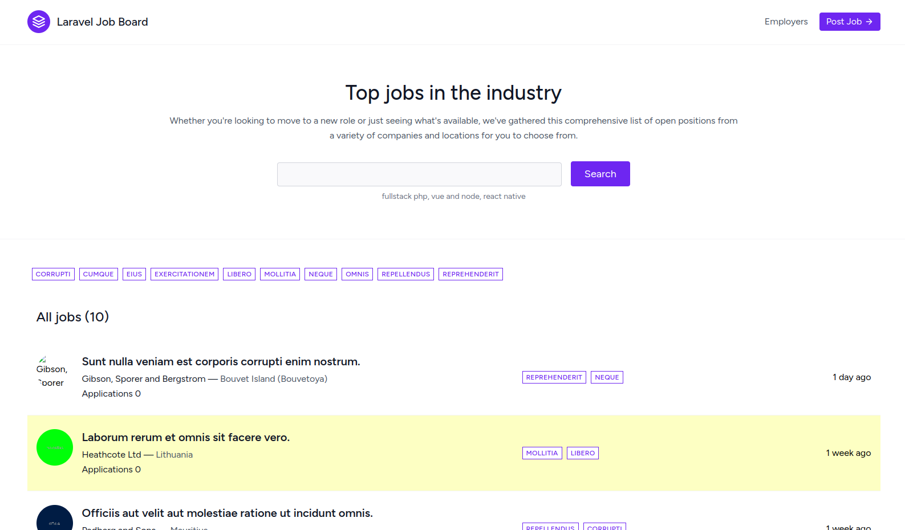
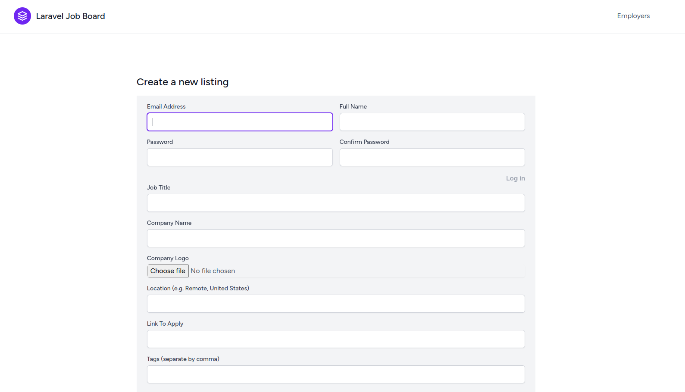
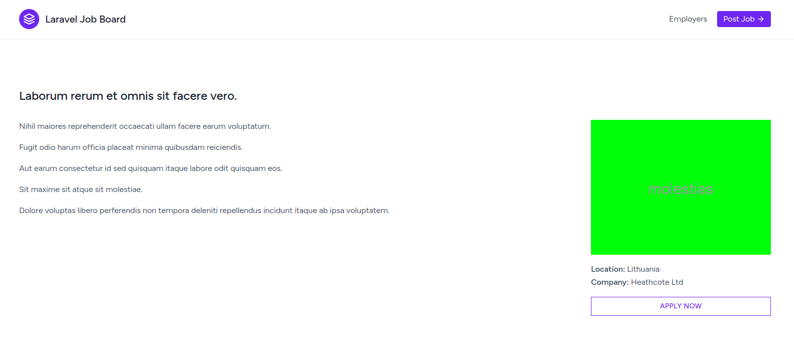
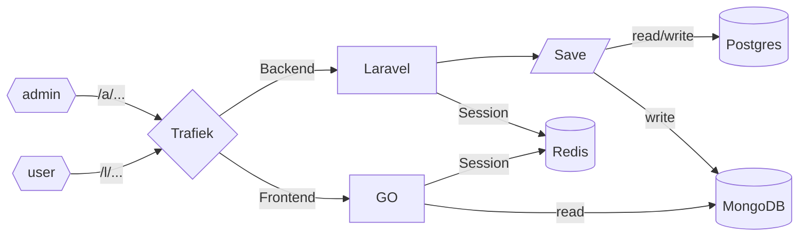

## About 

Built this "Job Posting" proof of concept to experiment more with Laravel 10, Vue 3, and Inertia. Eventually building a GO microservice that also uses Inertia to handle the frontend high load requests, loading its data from MongoDB, populated by Laravel and Postgres. Traefik will handle the routing of the frontend GO and the backend Laravel requests. I built a docker-compose for easy development as it uses many services.

### Resources
- Converted [this](https://www.youtube.com/playlist?list=PL36CGZHZJqsWs907QwJrWSbN2g2NNPn6w) tutorial from blade views to Inertia/Vue3 
- https://laravel.com/docs/10.x/starter-kits#breeze-and-inertia
- https://inertiajs.com/
- https://github.com/romsar/gonertia
- https://github.com/petaki/inertia-go

### Setup
- docker-compose build
- docker-compose up
  - This will handle the symlink to storage and db migrations
- npm install
- npm run dev
  - This will start VITE
- docker exec -it platform-app php artisan db:seed
  - And this will populate the database with users, listings and tags
- [http://localhost:9180/](http://localhost:9180/)

### Screenshots

### TODO
- ~Build a simple CRUD backend to the dashboard~
- ~Connect MongoDB to Laravel and add new models~
- Use observers to store data to MongoDB for frontend Vue views
- ~Build GO server project~ [Link](https://github.com/MonkoftheFunk/Job-Post-FE)
- Add GO frontend endpoints
- Copy and serve same Vue/Inertia files from GO
- Wire up GO server into docker-compose for Trafiek to route to
- Move Vue files to own repo that both repos can share
- Locust compare Laravel and GO frontend performance
- Share Redis user session
- Seamless login
- Get Stripe working
- Get Uploads working

